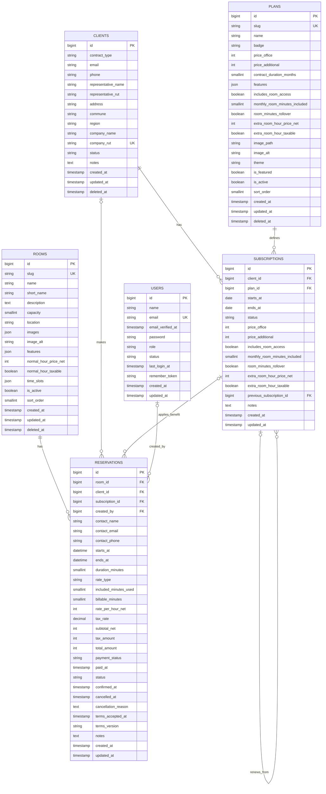

# Animal Co-work

Plataforma web para la contratación y gestión de servicios de oficina virtual en Chile.

Animal Co-work busca ofrecer una experiencia de contratación moderna, rápida y completamente digital, permitiendo que emprendedores, personas naturales y empresas seleccionen un plan, ingresen sus datos, revisen su contrato, realicen el pago y completen el proceso de firma electrónica desde una misma plataforma.

El proyecto se está desarrollando inicialmente como una landing page web autoadministrable con panel administrativo, gestión de clientes, contratos, pagos, contenido y servicios.

---

## Tabla de contenidos

* [Descripción del proyecto](#descripción-del-proyecto)
* [Objetivos](#objetivos)
* [Propuesta de valor](#propuesta-de-valor)
* [Flujo de contratación](#flujo-de-contratación)
* [Planes disponibles](#planes-disponibles)
* [Arquitectura](#arquitectura)
* [Tecnologías](#tecnologías)
* [Identidad visual](#identidad-visual)
* [Estructura funcional](#estructura-funcional)
* [Estructura del proyecto](#estructura-del-proyecto)
* [Estado actual](#estado-actual)
* [Requisitos](#requisitos)
* [Instalación local](#instalación-local)
* [Variables de entorno](#variables-de-entorno)
* [Comandos principales](#comandos-principales)
* [Base de datos](#base-de-datos)
* [Gestión de contratos](#gestión-de-contratos)
* [Panel administrativo](#panel-administrativo)
* [Despliegue](#despliegue)
* [Roadmap](#roadmap)
* [Convenciones de desarrollo](#convenciones-de-desarrollo)
* [Seguridad](#seguridad)
* [Repositorio](#repositorio)

---

## Descripción del proyecto

**Animal Co-work** es una plataforma para contratar servicios de oficina virtual y acreditar un domicilio tributario y comercial en Chile.

La aplicación permitirá que personas naturales y jurídicas puedan:

* Conocer los servicios disponibles.
* Comparar los planes de oficina virtual.
* Seleccionar un plan.
* Ingresar sus datos personales o empresariales.
* Visualizar un resumen de la contratación.
* Generar automáticamente un contrato.
* Previsualizar el contrato antes de confirmarlo.
* Confirmar y enviar el contrato para su procesamiento.
* Realizar el pago del servicio.
* Recibir comunicaciones relacionadas con su contratación.
* Gestionar posteriormente renovaciones y servicios asociados.

La plataforma también contará con un sistema administrativo para gestionar el contenido de la página, planes, clientes, solicitudes, contratos y pagos.

---

## Objetivos

### Objetivo principal

Crear una plataforma digital que permita contratar una oficina virtual de manera rápida, segura y completamente online.

### Objetivos específicos

* Digitalizar el proceso de contratación.
* Reducir el trabajo administrativo manual.
* Permitir la generación automática de contratos.
* Diferenciar el flujo de contratación entre personas naturales y jurídicas.
* Facilitar la revisión de información antes del pago.
* Integrar una pasarela de pagos.
* Centralizar la información de clientes y contratos.
* Permitir que el contenido de la web sea administrado sin modificar código.
* Mantener una experiencia visual coherente con la marca Animal Co-work.

---

## Propuesta de valor

### Mensaje principal

> La oficina virtual más conveniente de Chile.

### Mensajes comerciales

* 2 años por el precio de 1.
* Planes desde $59.990.
* Más de 6.000 emprendedores confían en nosotros.
* Únete a la manada de Animal Co-work.

### Información complementaria

> Acredita tu domicilio tributario con una dirección aceptada por el Servicio de Impuestos Internos. Firma tu contrato con Firma Electrónica Avanzada para una contratación rápida, segura y 100% online.

### Llamado a la acción principal

> Quiero mi oficina virtual

---

## Flujo de contratación

La contratación se divide en varias etapas.

### Paso 1: Selección del plan

El usuario revisa los planes disponibles y selecciona el que mejor se adapte a sus necesidades.

Cada plan muestra:

* Nombre.
* Descripción.
* Servicios incluidos.
* Precio.
* Duración del contrato.
* Indicadores comerciales, como “Más vendido” o “Recomendado”.
* Imagen representativa del animal asociado al plan.

### Paso 2: Formulario de contratación

Después de seleccionar un plan, el usuario completa un formulario con sus datos.

El sistema debe permitir diferenciar entre:

* Persona natural.
* Persona jurídica.

Los campos y validaciones cambian según el tipo de cliente.

#### Persona natural

El formulario podrá incluir:

* Nombre completo.
* RUT.
* RUT de representante legal
* Razón social.
* Dirección del representante legal

#### Persona jurídica

El formulario podrá incluir:

* Nombre completo.
* RUT.
* RUT de representante legal
* Razón social.
* Dirección del representante legal

### Paso 3: Previsualización y confirmación del contrato

El sistema generará automáticamente el contrato correspondiente al plan y tipo de cliente seleccionado.

Se utilizarán dos documentos de referencia:

* Contrato para persona natural.
* Contrato para persona jurídica.

Los documentos serán utilizados como plantillas y deberán completarse con los datos ingresados en el formulario.

La previsualización debe:

* Mantener la estructura legal del documento original.
* Reemplazar los campos dinámicos con los datos del cliente.
* Mostrar los datos del plan seleccionado.
* Mostrar la duración del servicio.
* Mostrar el valor contratado.
* Mostrar los datos de Animal Co-work.
* Permitir revisar el contenido antes de confirmar.
* Adaptarse correctamente a escritorio y dispositivos móviles.
* Mantener una presentación clara y similar a un documento formal.
* Mostrar páginas o secciones de forma legible.
* Evitar modificar el contenido legal que no sea dinámico.

En la parte inferior de la página se mostrará el botón:

> Confirmar contrato

Al confirmar:

1. El sistema valida que existan todos los datos obligatorios.
2. Se registra la aceptación del documento.
3. Se guarda la versión exacta del contrato aceptado.
4. Se registra la fecha y hora de confirmación.
5. El contrato se envía al correo corporativo destinado a su procesamiento.
6. Se informa al usuario que la solicitud fue recibida correctamente.
7. Un ejecutivo toma contacto con el cliente en un plazo máximo de 2 horas hábiles.

La confirmación del contrato debe evitar envíos duplicados.

### Paso 4: Pago

En una etapa posterior se integrará una pasarela de pagos.

El sistema deberá:

* Mostrar el monto total.
* Asociar el pago con la solicitud y el contrato.
* Registrar el estado de la transacción.
* Manejar pagos aprobados, pendientes, rechazados o anulados.
* Guardar el identificador entregado por la pasarela.
* Evitar registrar pagos duplicados.
* Mostrar una confirmación clara al usuario.

### Paso 5: Firma electrónica

La plataforma deberá integrar un proceso de firma electrónica.

El objetivo es permitir que el cliente firme el contrato sin abandonar la plataforma o mediante un flujo externo controlado.

El sistema deberá registrar:

* Estado de firma.
* Fecha de envío.
* Fecha de firma.
* Identificador del proceso.
* Documento firmado.
* Evidencia o certificado de firma, cuando corresponda.

---

## Planes disponibles

Los planes se muestran horizontalmente en escritorio y de forma adaptable en dispositivos móviles.

### FÉNIX

**Etiqueta:** Más vendido

Incluye:

* Contrato de oficina virtual por 2 años.
* Dirección tributaria.
* Dirección comercial.
* Recepción de documentos y correspondencia.
* Escaneo de documentos.
* Acceso a sala de reuniones.

**Precio:** $59.990

### LOBO

**Etiqueta:** Recomendado

Incluye:

* Gestión de patente comercial.
* Contrato de oficina virtual por 1 año.
* Dirección tributaria.
* Dirección comercial.
* Recepción de documentos y correspondencia.
* Escaneo de documentos.
* Acceso a sala de reuniones.

**Precio:** $89.990

### LEÓN

Incluye:

* Contrato de oficina virtual por 2 años.
* Dirección tributaria.
* Dirección comercial.
* Recepción de documentos y correspondencia.
* Escaneo de documentos.
* Acceso a sala de reuniones.

**Precio:** $98.000

### Renovación de contratos

Después de la sección de planes se incorporará una sección específica para clientes existentes.

Texto de referencia:

> ¿Necesitas renovar tu contrato? Renueva aquí.

Esta sección deberá dirigir a un flujo de renovación independiente o a un formulario específico.

---

## Arquitectura

El proyecto utiliza una arquitectura de monolito modular.

Laravel administra:

* Rutas.
* Lógica de negocio.
* Validaciones.
* Persistencia.
* Autenticación.
* Autorización.
* Envío de correos.
* Generación de contratos.
* Integraciones externas.
* Panel administrativo.

React se utiliza para construir la interfaz de usuario mediante Inertia.js.

Esta arquitectura evita mantener dos aplicaciones completamente separadas y permite compartir autenticación, sesiones, validaciones y despliegue.

### Principios de arquitectura

* Mantener una única fuente de verdad.
* Separar responsabilidades por módulos.
* Evitar lógica de negocio dentro de los componentes visuales.
* Reutilizar componentes.
* Mantener validaciones tanto en frontend como en backend.
* No modificar partes no relacionadas con una funcionalidad.
* Preparar integraciones externas mediante servicios independientes.
* Mantener control de versiones de los contratos.
* Evitar dependencias innecesarias.
* Priorizar compatibilidad con hosting tradicional.

---

## Tecnologías

### Backend

* PHP 8.3.
* Laravel 13.
* Composer.
* MySQL.
* Inertia.js.
* Laravel Mail.
* Laravel Validation.
* Laravel Queues para procesos que puedan ejecutarse de forma diferida.
* Filament para el panel administrativo, sujeto a compatibilidad final con producción.

### Frontend

* React.
* TypeScript.
* Inertia React.
* Vite.
* Tailwind CSS 4.
* HTML5.
* CSS moderno.
* Componentes reutilizables.

### Herramientas de desarrollo

* Laravel Herd.
* Composer.
* Node.js.
* npm.
* Git.
* GitLab.
* Visual Studio Code.
* Codex como apoyo de desarrollo.
* ImageMagick para optimización de imágenes.

### Versiones utilizadas durante el desarrollo

* Laravel 13.21.1.
* PHP 8.3.32.
* Composer 2.9.8.
* Node.js 24.18.0.
* npm 11.4.2.
* Vite 6.4.3.
* Tailwind CSS 4.3.3.
* `@inertiajs/react` 3.6.1.
* `@inertiajs/vite` 3.6.1.
* Laravel Installer 5.31.0.
* Herd 1.29.0.

Las versiones pueden cambiar durante el desarrollo. Se recomienda respetar las versiones declaradas en `composer.json`, `composer.lock`, `package.json` y `package-lock.json`.

---

## Identidad visual

La identidad visual de Animal Co-work comunica energía, confianza, naturaleza y profesionalismo.

### Colores principales

#### Verde Instinto

```text
HEX: #6AAE3B
RGB: 106, 174, 59
CMYK: 60%, 0%, 100%, 0%
```

Uso recomendado:

* Botones principales.
* Elementos destacados.
* Bordes.
* Indicadores activos.
* Llamados a la acción.
* Detalles relacionados con crecimiento y naturaleza.

#### Azul Profundo

```text
HEX: #0D1B3D
RGB: 13, 27, 61
CMYK: 100%, 90%, 30%, 70%
```

Uso recomendado:

* Títulos.
* Texto principal.
* Navegación.
* Fondos oscuros.
* Elementos de confianza y profesionalismo.

### Colores secundarios

#### Azul Energía

```text
HEX: #114DFF
RGB: 17, 77, 255
CMYK: 90%, 65%, 0%, 0%
```

Uso recomendado:

* Enlaces.
* Estados interactivos.
* Elementos secundarios.
* Detalles gráficos.

#### Blanco

```text
HEX: #FFFFFF
RGB: 255, 255, 255
```

Uso recomendado:

* Fondos.
* Texto sobre fondos oscuros.
* Espacios de descanso visual.
* Componentes y tarjetas.

### Tipografía

* Montserrat Bold para títulos.
* Montserrat Regular para textos y descripciones.

### Iconografía

La iconografía debe mantener:

* Líneas simples.
* Contornos en azul profundo.
* Rellenos blancos.
* Estilo moderno y limpio.
* Consistencia de grosor.
* Buena legibilidad en tamaños pequeños.

### Animales de los planes

Cada plan está asociado a un animal:

* Fénix.
* Lobo.
* León.

Las imágenes deben:

* Mantener una estética coherente.
* Usar fondos compatibles con las tarjetas.
* Estar optimizadas para web.
* Preferentemente utilizar formato WebP.
* Evitar archivos excesivamente pesados.
* Mantener una composición centrada.
* Funcionar correctamente con `object-cover`.
* Permitir degradados o capas sobre la imagen.

### Inspiración visual

Se busca:

* Diseño limpio.
* Secciones amplias.
* Jerarquía tipográfica clara.
* Tarjetas modernas.
* Uso estratégico de fondos.
* Botones visibles.
* Buena experiencia móvil.
* Apariencia profesional, comercial y cercana.

---

## Estructura funcional

### Landing page

La página principal incluye o incluirá:

* Header.
* Hero principal.
* Mensaje comercial.
* Llamado a la acción.
* Información sobre domicilio tributario.
* Información sobre Firma Electrónica Avanzada.
* Indicador de más de 6.000 emprendedores.
* Sección de planes.
* Sección de renovación.
* Sección de beneficios.
* Sección de preguntas frecuentes.
* Footer.
* Enlaces legales.

### Header

El encabezado utiliza los logos ubicados en:

```text
public/images/Logo/logo.webp
```

El header debe:

* Mantenerse coherente con la identidad visual.
* Contar con navegación clara.
* Incluir un botón principal.
* Ser adaptable a móviles.
* Evitar bordes excesivamente redondeados.
* Utilizar detalles visuales sutiles.

### Hero

El hero actual utiliza:
* Fonfo blanco.
* Halo o elemento visual en verde.
* Texto principal.
* Mensaje comunitario.
* Llamado a la acción.
* Subrayado o línea decorativa.

### Tarjeta informativa

La información sobre domicilio tributario y firma electrónica se presenta en una tarjeta con:

* Fondo transparente o blanco.
* Borde verde.
* Texto azul profundo.
* Separación visual clara.
* Diseño adaptable.

### Tarjetas de planes

Las tarjetas deben:

* Mostrar tres planes horizontalmente en escritorio.
* Adaptarse a una columna o carrusel en pantallas pequeñas.
* Incluir imagen.
* Incluir nombre.
* Incluir etiqueta comercial.
* Incluir lista de beneficios.
* Incluir precio.
* Incluir botón de contratación.
* Mantener alturas visualmente consistentes.
* Respetar la identidad visual.

---

## Estructura del proyecto

La estructura puede evolucionar durante el desarrollo.

```text
animal-cowork/
├── app/
│   ├── Actions/
│   ├── Http/
│   │   ├── Controllers/
│   │   ├── Middleware/
│   │   ├── Requests/
│   │   └── Resources/
│   ├── Mail/
│   ├── Models/
│   ├── Notifications/
│   ├── Policies/
│   ├── Providers/
│   ├── Services/
│   └── Support/
├── bootstrap/
├── config/
├── database/
│   ├── factories/
│   ├── migrations/
│   └── seeders/
├── public/
│   ├── build/
│   └── images/
│       ├── Logo/
│       ├── hero/
│       └── plans/
├── resources/
│   ├── css/
│   │   └── app.css
│   ├── js/
│   │   ├── components/
│   │   ├── layouts/
│   │   ├── pages/
│   │   ├── types/
│   │   ├── app.tsx
│   │   └── ssr.tsx
│   └── views/
│       └── app.blade.php
├── routes/
│   ├── console.php
│   └── web.php
├── storage/
├── tests/
│   ├── Feature/
│   └── Unit/
├── .env.example
├── artisan
├── composer.json
├── package.json
├── tailwind.config.js
├── tsconfig.json
└── vite.config.ts
```

### Organización sugerida del frontend

```text
resources/js/
├── components/
│   ├── common/
│   ├── forms/
│   ├── layout/
│   ├── plans/
│   └── contracts/
├── layouts/
│   ├── public-layout.tsx
│   └── authenticated-layout.tsx
├── pages/
│   ├── welcome.tsx
│   ├── plans/
│   ├── contracts/
│   ├── checkout/
│   └── dashboard/
├── types/
└── app.tsx
```

### Organización sugerida del backend

```text
app/
├── Http/
│   ├── Controllers/
│   │   ├── ContractController.php
│   │   ├── HiringController.php
│   │   ├── PaymentController.php
│   │   └── RenewalController.php
│   └── Requests/
│       ├── StoreNaturalPersonHiringRequest.php
│       ├── StoreLegalEntityHiringRequest.php
│       └── ConfirmContractRequest.php
├── Models/
│   ├── Plan.php
│   ├── Customer.php
│   ├── Company.php
│   ├── HiringRequest.php
│   ├── Contract.php
│   ├── Payment.php
│   └── Renewal.php
├── Services/
│   ├── Contracts/
│   ├── Payments/
│   ├── Signatures/
│   └── Notifications/
└── Mail/
```

---

## Estado actual

### Implementado

* Proyecto base en Laravel.
* Integración con Inertia.js.
* Frontend en React y TypeScript.
* Configuración de Tailwind CSS.
* Página inicial.
* Header.
* Hero.
* Identidad visual inicial.
* Botones reutilizables.
* Componente de botón secundario.
* Tarjeta informativa sobre domicilio tributario.
* Estructura inicial de planes.
* Imágenes conceptuales de Fénix, Lobo y León.
* Optimización de imágenes a WebP.
* Repositorio Git configurado.
* Pruebas iniciales de despliegue.

### En desarrollo

* Flujo completo de contratación.
* Formulario para persona natural.
* Formulario para persona jurídica.
* Validaciones del backend.
* Persistencia de solicitudes.
* Previsualización de contratos.
* Generación dinámica de contratos.
* Confirmación del contrato.
* Envío automático por correo.
* Control de errores en frontend.
* Mensajes de validación mediante Inertia.
* Sección de renovación.

### Pendiente

* Panel administrativo.
* Gestión de contenido.
* Gestión de planes.
* Gestión de clientes.
* Gestión de contratos.
* Pasarela de pagos.
* Firma electrónica.
* Historial de estados.
* Notificaciones automáticas.
* Sistema de renovación.
* Despliegue definitivo en iHost.
* Configuración de dominio definitivo.
* Automatización de despliegue.
* Pruebas integrales.
* Políticas de privacidad.
* Términos y condiciones.
* Sistema de respaldo.
* Monitoreo de errores.

---

## Requisitos

Antes de instalar el proyecto se debe contar con:

* PHP 8.3 o una versión compatible con el proyecto.
* Composer.
* Node.js.
* npm.
* MySQL.
* Git.
* Extensiones de PHP requeridas por Laravel.

### Extensiones recomendadas de PHP

* BCMath.
* Ctype.
* cURL.
* DOM.
* Fileinfo.
* JSON.
* Mbstring.
* OpenSSL.
* PDO.
* PDO MySQL.
* Tokenizer.
* XML.

En Windows se recomienda utilizar Laravel Herd.

---

## Instalación local

### 1. Clonar el repositorio

```bash
git clone https://gitlab.com/latasoft-group/animal-cowork.git
```

Ingresar al proyecto:

```bash
cd animal-cowork
```

### 2. Instalar dependencias de PHP

```bash
composer install
```

### 3. Instalar dependencias de Node.js

```bash
npm install
```

Para reproducir exactamente las versiones bloqueadas:

```bash
npm ci
```

### 4. Crear el archivo de entorno

En macOS o Linux:

```bash
cp .env.example .env
```

En PowerShell:

```powershell
Copy-Item .env.example .env
```

En CMD:

```cmd
copy .env.example .env
```

### 5. Generar la clave de Laravel

```bash
php artisan key:generate
```

### 6. Configurar la base de datos

Crear una base de datos MySQL.

Ejemplo:

```sql
CREATE DATABASE animal_cowork
CHARACTER SET utf8mb4
COLLATE utf8mb4_unicode_ci;
```

Configurar las credenciales en `.env`.

### 7. Ejecutar las migraciones

```bash
php artisan migrate
```

Para ejecutar seeders:

```bash
php artisan db:seed
```

También se puede utilizar:

```bash
php artisan migrate --seed
```

### 8. Crear el enlace de almacenamiento

```bash
php artisan storage:link
```

### 9. Ejecutar el proyecto

En una terminal:

```bash
php artisan serve
```

En otra terminal:

```bash
npm run dev
```

La aplicación estará disponible normalmente en:

```text
http://127.0.0.1:8000
```

Cuando se utiliza Laravel Herd, el dominio local puede depender del nombre de la carpeta.

---

## Variables de entorno

Ejemplo básico:

```env
APP_NAME="Animal Co-work"
APP_ENV=local
APP_KEY=
APP_DEBUG=true
APP_URL=http://localhost:8000

APP_LOCALE=es
APP_FALLBACK_LOCALE=es
APP_FAKER_LOCALE=es_CL

LOG_CHANNEL=stack
LOG_LEVEL=debug

DB_CONNECTION=mysql
DB_HOST=127.0.0.1
DB_PORT=3306
DB_DATABASE=animal_cowork
DB_USERNAME=root
DB_PASSWORD=

SESSION_DRIVER=database
SESSION_LIFETIME=120
SESSION_ENCRYPT=false
SESSION_PATH=/
SESSION_DOMAIN=null

CACHE_STORE=database
QUEUE_CONNECTION=database

MAIL_MAILER=smtp
MAIL_HOST=
MAIL_PORT=587
MAIL_USERNAME=
MAIL_PASSWORD=
MAIL_ENCRYPTION=tls
MAIL_FROM_ADDRESS=
MAIL_FROM_NAME="${APP_NAME}"

VITE_APP_NAME="${APP_NAME}"
```

No se deben subir credenciales reales al repositorio.

El archivo `.env` debe permanecer excluido mediante `.gitignore`.

---

## Comandos principales

### Desarrollo

```bash
composer run dev
```

Cuando el script se encuentra configurado, este comando puede ejecutar de forma conjunta:

* Servidor Laravel.
* Worker de colas.
* Logs.
* Servidor de Vite.

### Ejecutar backend

```bash
php artisan serve
```

### Ejecutar frontend

```bash
npm run dev
```

### Compilar frontend

```bash
npm run build
```

### Limpiar cachés

```bash
php artisan optimize:clear
```

### Generar cachés para producción

```bash
php artisan optimize
```

### Ejecutar migraciones

```bash
php artisan migrate
```

### Revertir última migración

```bash
php artisan migrate:rollback
```

### Reiniciar base de datos local

```bash
php artisan migrate:fresh --seed
```

No utilizar este comando en producción.

### Ejecutar pruebas

```bash
php artisan test
```

### Ejecutar worker de colas

```bash
php artisan queue:work
```

### Revisar rutas

```bash
php artisan route:list
```

---

## Base de datos

La base de datos debe diseñarse de manera modular y normalizada.
# Modelo de Base de Datos

La base de datos de **Animal Co-work** está diseñada para soportar la gestión de planes de oficina virtual, clientes, suscripciones, usuarios administrativos, salas de reuniones y reservas.

Actualmente, el modelo principal está compuesto por las siguientes tablas:

* `plans`
* `clients`
* `subscriptions`
* `users`
* `rooms`
* `reservations`

## Diagrama Entidad-Relación



## Descripción de las tablas

### `plans`

Almacena la configuración comercial de los planes disponibles de Animal Co-work.

Actualmente existen los planes:

* Lobo
* Fénix
* León

La tabla incluye información relacionada con:

* Nombre e identificador del plan.
* Precio correspondiente a oficina virtual.
* Precio de servicios adicionales.
* Duración del contrato.
* Características incluidas.
* Acceso a salas de reuniones.
* Minutos gratuitos mensuales.
* Tarifa de horas adicionales.
* Imágenes y configuración visual.
* Estado activo o inactivo.

Los precios se almacenan como números enteros en pesos chilenos.

El precio total de un plan se obtiene mediante:

```text
price_office + price_additional
```

De esta forma se evita almacenar información redundante.

---

### `clients`

Representa a los clientes comerciales de Animal Co-work.

Un cliente puede contratar como:

```text
natural
legal
```

Donde:

* `natural` corresponde a persona natural con giro.
* `legal` corresponde a persona jurídica.

La tabla almacena:

* Correo electrónico.
* Número telefónico.
* Nombre del representante legal.
* RUT del representante.
* Dirección particular.
* Comuna.
* Región.
* Razón social o nombre comercial.
* RUT de empresa.
* Estado administrativo.
* Observaciones internas.

El `company_rut` es único y representa la principal identificación comercial del cliente.

El RUT del representante no es único, ya que una misma persona puede representar múltiples empresas.

Los RUT se almacenan normalizados, preferentemente sin puntos y con dígito verificador:

```text
12345678-K
```

---

### `subscriptions`

Representa la contratación de un plan por parte de un cliente durante un período determinado.

Esta tabla permite mantener el historial completo de contrataciones y renovaciones.

Relación principal:

```text
Client
   ↓
Subscription
   ↓
Plan
```

Una suscripción contiene:

* Cliente asociado.
* Plan contratado.
* Fecha de inicio.
* Fecha de término.
* Estado.
* Precio de oficina virtual al momento de contratar.
* Precio adicional al momento de contratar.
* Beneficio mensual de sala.
* Tarifa adicional de sala.
* Referencia a una suscripción anterior en caso de renovación.

Los precios y beneficios se copian desde el plan al crear la suscripción.

Esto permite conservar las condiciones históricas aunque posteriormente cambien los precios o características del plan.

Ejemplo:

```text
Plan Fénix actual
$69.990

Suscripción antigua
$59.990
```

La suscripción antigua mantiene siempre el valor contratado originalmente.

Los estados contemplados inicialmente son:

```text
pending
active
expired
cancelled
```

Las renovaciones se representan mediante:

```text
previous_subscription_id
```

permitiendo construir un historial como:

```text
Lobo
2025 → 2026
   ↓
Fénix
2026 → 2028
```

---

### `users`

Corresponde a los usuarios internos que tienen acceso al sistema administrativo.

No representa clientes.

Los roles contemplados inicialmente son:

```text
super_admin
admin
executive
reception
```

La tabla almacena:

* Nombre.
* Correo electrónico.
* Contraseña.
* Rol.
* Estado.
* Último inicio de sesión.

Los estados iniciales son:

```text
active
inactive
```

La autenticación utiliza el sistema proporcionado por Laravel y las contraseñas se almacenan mediante hashing.

---

### `rooms`

Representa las salas de reuniones disponibles en Animal Co-work.

Actualmente existen:

```text
Sala 1
Sala 2
```

Cada sala almacena:

* Nombre.
* Nombre corto.
* Capacidad.
* Descripción.
* Ubicación.
* Imágenes.
* Características.
* Tarifa normal.
* Bloques horarios disponibles.
* Estado.

Las imágenes y características se almacenan como JSON para evitar tablas adicionales innecesarias.

Ejemplo de características:

```json
[
    "Aire acondicionado",
    "Conexiones eléctricas",
    "Smart TV de 55\"",
    "Pizarra de vidrio",
    "Cafetera",
    "Dispensador de agua"
]
```

Los bloques horarios también se almacenan como JSON.

Ejemplo:

```json
{
    "id": "10-11",
    "start": "10:00",
    "end": "11:10",
    "billable_minutes": 60
}
```

Esto permite distinguir entre:

```text
Tiempo bloqueado de sala
70 minutos

Tiempo contratado/facturable
60 minutos
```

---

## Reglas de las salas

### Sala 1

La Sala 1 permite actualmente los siguientes bloques:

```text
10:00 → 11:10
11:20 → 12:30
12:40 → 13:50
14:00 → 15:10
15:20 → 16:30
16:40 → 17:50
18:00 → 19:10
```

Cada bloque corresponde a:

```text
60 minutos de uso
+
10 minutos operativos para limpieza/preparación
```

Por lo tanto:

```text
Bloque de disponibilidad: 70 minutos
Tiempo cobrado:            60 minutos
Tiempo descontado:         60 minutos
```

Los 10 minutos destinados a limpieza no se cobran ni descuentan del beneficio del cliente.

---

### Sala 2

Actualmente la Sala 2 tiene únicamente disponible:

```text
18:00 → 20:00
```

Este bloque es indivisible.

Por lo tanto, no es posible reservar:

```text
18:00 → 19:00
19:00 → 20:00
```

La reserva debe realizarse obligatoriamente por las dos horas completas:

```text
18:00 → 20:00
120 minutos
```

---

### `reservations`

Representa cada reserva realizada sobre una sala.

Una reserva puede corresponder a:

* Un cliente con una suscripción vigente.
* Un cliente sin beneficio disponible.
* Público general.
* Una reserva creada manualmente por un usuario administrativo.

La tabla relaciona:

```text
Room
Client
Subscription
User
```

según corresponda.

También conserva un snapshot de los datos de contacto:

* Nombre.
* Correo.
* Teléfono.

Esto evita que una modificación posterior de los datos del cliente cambie el registro histórico de una reserva.

---

## Tiempo reservado vs. tiempo bloqueado

La aplicación distingue dos conceptos.

### Tiempo bloqueado

Está representado por:

```text
starts_at
ends_at
```

Indica durante cuánto tiempo la sala no puede ser utilizada por otra persona.

Ejemplo Sala 1:

```text
starts_at = 10:00
ends_at   = 11:10
```

La sala queda bloqueada durante 70 minutos.

### Tiempo contratado

Está representado por:

```text
duration_minutes
```

Para el mismo ejemplo:

```text
duration_minutes = 60
```

Solo estos 60 minutos se utilizan para calcular:

* Beneficios incluidos.
* Horas adicionales.
* Cobros.

Los minutos de limpieza no se cobran.

---

## Beneficio de salas para clientes vigentes

Los clientes con una suscripción vigente de oficina virtual tienen derecho actualmente a:

```text
2 horas mensuales gratuitas
```

Internamente se almacenan como:

```text
120 minutos
```

Esto facilita los cálculos.

Las horas:

* No son acumulables.
* Se reinician cada mes.
* No generan devolución si no son utilizadas.

Ejemplo:

```text
Saldo inicial mensual
120 minutos

Reserva 1
60 minutos

Saldo restante
60 minutos

Reserva 2
60 minutos

Saldo restante
0 minutos
```

Al comenzar un nuevo mes, el cliente vuelve a disponer de:

```text
120 minutos
```

No es necesario almacenar manualmente un saldo mensual, ya que este se puede calcular a partir de las reservas confirmadas del período.

---

## Tarifas de salas

### Cliente vigente

Una vez agotadas las horas incluidas:

```text
$7.000 netos + IVA por hora adicional
```

Esta tarifa se conserva como snapshot dentro de la suscripción.

### Público general

La tarifa normal actual es:

```text
$12.000 netos + IVA por hora
```

Esta tarifa pertenece a la configuración de la sala.

---

## Cálculo de una reserva

Una reserva almacena:

```text
duration_minutes
included_minutes_used
billable_minutes
rate_per_hour_net
tax_rate
subtotal_net
tax_amount
total_amount
```

Ejemplo de cliente que ya agotó sus horas gratuitas:

```text
Reserva:
60 minutos

Minutos gratuitos:
0

Minutos cobrables:
60

Tarifa:
$7.000 netos

IVA:
$1.330

Total:
$8.330
```

Ejemplo para público general en Sala 2:

```text
Reserva:
120 minutos

Tarifa:
$12.000 netos por hora

Subtotal:
$24.000

IVA:
$4.560

Total:
$28.560
```

---

## Estados de reserva

Los estados contemplados inicialmente son:

```text
pending
confirmed
completed
cancelled
no_show
```

Para efectos del consumo de las horas gratuitas, se consideran inicialmente:

```text
confirmed
completed
no_show
```

No consumen beneficio:

```text
pending
cancelled
```

---

## Estados de pago

Las reservas pueden tener:

```text
unpaid
pending
paid
waived
```

`waived` se utiliza cuando la reserva está completamente cubierta por el beneficio mensual del cliente y no existe monto que pagar.

---

## Disponibilidad de salas

La disponibilidad no se almacena directamente como:

```text
available = true
```

porque depende de la fecha y de las reservas existentes.

La disponibilidad se calcula dinámicamente utilizando:

```text
rooms.time_slots
+
reservations
```

Una sala se considera ocupada cuando existe una reserva activa cuyo intervalo se solapa con el bloque solicitado.

Conceptualmente:

```text
existing.starts_at < requested_end
AND
existing.ends_at > requested_start
```

Esto permite considerar también los minutos destinados a limpieza.

---

## Renovaciones

Una renovación no modifica ni reemplaza una suscripción existente.

Se crea una nueva:

```text
Client
 │
 ├── Subscription #1
 │      Lobo
 │      2025 → 2026
 │
 └── Subscription #2
        Fénix
        2026 → 2028
```

La segunda suscripción mantiene:

```text
previous_subscription_id = Subscription #1
```

De esta forma se conserva completamente el historial contractual del cliente.

---

## Datos que deliberadamente no se almacenan en `clients`

La tabla `clients` representa la identidad comercial del cliente.

Por este motivo no almacena directamente:

```text
plan_id
coupon_id
payment_id
terms_accepted
privacy_accepted
```

Un cliente puede contratar diferentes planes y servicios a lo largo del tiempo, por lo que estos datos pertenecen a las contrataciones y transacciones correspondientes.

En futuras etapas se incorporarán entidades como:

```text
orders
order_items
payments
coupons
contracts
additional_services
```

sin necesidad de modificar la estructura principal de clientes.

---

## Seeders de desarrollo

El entorno de desarrollo incluye seeders iniciales para poder probar diferentes escenarios del sistema:

```text
PlanSeeder
ClientSeeder
SubscriptionSeeder
UserSeeder
RoomSeeder
ReservationSeeder
```

Estos permiten disponer de:

* Planes iniciales.
* Clientes ficticios.
* Suscripciones vigentes y vencidas.
* Casos de renovación.
* Usuarios administrativos.
* Salas configuradas.
* Reservas gratuitas y pagadas.
* Reservas de público general.

Los datos ficticios utilizan dominios como:

```text
example.test
animal.test
```

para reducir el riesgo de enviar accidentalmente comunicaciones a direcciones reales.

Para regenerar completamente la base de datos de desarrollo:

```bash
php artisan migrate:fresh --seed
```

> **Advertencia:** este comando elimina todas las tablas y datos existentes antes de volver a ejecutar las migraciones y seeders. Debe utilizarse únicamente en entornos de desarrollo o pruebas.


#### Historial de estados

Permite registrar cada cambio importante de una solicitud, contrato, pago o renovación.

---

## Gestión de contratos

La gestión de contratos es una parte central del proyecto.

### Plantillas

Existirán al menos dos plantillas:

* Persona natural.
* Persona jurídica.

Las plantillas pueden provenir de documentos Word entregados como referencia.

Los documentos no deben utilizarse directamente desde el navegador. El sistema debe convertir su estructura en una plantilla controlada por la aplicación.

### Datos dinámicos

Los contratos pueden incluir variables como:

```text
{{customer.full_name}}
{{customer.rut}}
{{customer.email}}
{{customer.address}}
{{company.business_name}}
{{company.rut}}
{{company.legal_representative}}
{{plan.name}}
{{plan.price}}
{{plan.duration}}
{{contract.start_date}}
{{contract.confirmed_at}}
```

### Requisitos de generación

* Mantener el contenido legal.
* Escapar datos ingresados por usuarios.
* Validar todos los campos.
* Guardar una copia inmutable del contrato confirmado.
* Registrar versión de plantilla.
* Registrar fecha y hora.
* Generar un identificador único.
* Evitar modificaciones posteriores sobre contratos confirmados.
* Permitir exportar a PDF en una etapa posterior.
* Permitir descargar o enviar el documento.
* Mantener trazabilidad.

### Estados sugeridos

```text
draft
generated
reviewed
confirmed
sent
pending_signature
signed
rejected
cancelled
expired
```

---

## Panel administrativo

El panel administrativo permitirá gestionar el contenido y la operación del negocio.

### Funcionalidades esperadas

* Inicio de sesión seguro.
* Roles y permisos.
* Dashboard.
* Gestión de planes.
* Gestión de beneficios.
* Gestión de precios.
* Gestión de contenido de la landing.
* Gestión de clientes.
* Gestión de empresas.
* Gestión de solicitudes.
* Gestión de contratos.
* Gestión de renovaciones.
* Gestión de pagos.
* Gestión de estados.
* Gestión de correos.
* Descarga de documentos.
* Historial de actividad.
* Filtros y búsquedas.
* Exportación de información.
* Métricas comerciales.

### Roles sugeridos

* Superadministrador.
* Administrador.
* Ejecutivo.
* Finanzas.
* Soporte.
* Solo lectura.

Cada acción sensible debe estar protegida por permisos.

---

## Despliegue

El objetivo final es desplegar el proyecto en un hosting tradicional de iHost con cPanel y base de datos MySQL.

### Dominio

Dominio objetivo:

```text
animalcoworking.cl
```

Subdominios o entornos evaluados:

```text
animal-cowork.latasoft.cl
preview.animalcoworking.cl
```

### Document root utilizado en pruebas

```text
/public_html/animal-cowork.latasoft.cl
```

La carpeta pública del dominio debe apuntar al directorio `public` de Laravel.

Nunca se debe exponer la raíz completa del proyecto.

### Pasos generales de producción

1. Subir o clonar el repositorio.
2. Configurar `.env`.
3. Instalar dependencias PHP.

```bash
composer install --no-dev --optimize-autoloader
```

4. Instalar dependencias frontend.

```bash
npm ci
```

5. Compilar recursos.

```bash
npm run build
```

6. Ejecutar migraciones.

```bash
php artisan migrate --force
```

7. Crear enlace de almacenamiento.

```bash
php artisan storage:link
```

8. Limpiar y regenerar cachés.

```bash
php artisan optimize:clear
php artisan optimize
```

9. Configurar permisos de escritura para:

```text
storage/
bootstrap/cache/
```

10. Configurar tareas programadas.

Ejemplo de cron:

```bash
* * * * * cd /ruta/al/proyecto && php artisan schedule:run >> /dev/null 2>&1
```

11. Configurar procesamiento de colas si el hosting lo permite.

### HTTPS

La aplicación debe ejecutarse completamente sobre HTTPS.

Se debe evitar que Laravel o Vite generen recursos con HTTP cuando la página se sirve con HTTPS.

Una configuración incorrecta puede provocar errores de contenido mixto, por ejemplo:

```text
Mixed Content: requested an insecure script over HTTP.
```

En producción se debe verificar:

```env
APP_ENV=production
APP_DEBUG=false
APP_URL=https://animalcoworking.cl
```

Cuando exista un proxy inverso, Laravel debe confiar correctamente en los encabezados de proxy.

### Pruebas realizadas

Se realizaron pruebas de despliegue en Railway.

Durante estas pruebas se detectaron:

* Problemas de bloqueo dentro de `node_modules/.vite`.
* Errores `EBUSY` durante la compilación.
* Página en blanco por recursos generados con HTTP.
* Bloqueo del navegador por contenido mixto.

Railway se utilizó como entorno de prueba, pero el objetivo final continúa siendo iHost.

---

## Optimización de imágenes

Las imágenes deben convertirse preferentemente a WebP.

Ejemplo para convertir una imagen:

```bash
magick "Fondo.jpeg" -resize "1920x1920>" -strip -quality 82 "Fondo.webp"
```

Para convertir las imágenes de los animales y eliminar los originales:

### PowerShell

```powershell
magick "lobo.png" -resize "1920x1920>" -strip -quality 82 "lobo.webp"
magick "phenix.png" -resize "1920x1920>" -strip -quality 82 "phenix.webp"
magick "leon.png" -resize "1920x1920>" -strip -quality 82 "leon.webp"

Remove-Item "lobo.png", "phenix.png", "leon.png"
```

Antes de eliminar archivos originales se recomienda verificar que los WebP se hayan generado correctamente.

---

## Roadmap

### Fase 1: Frontend público

* [x] Crear proyecto base.
* [x] Configurar Laravel, React e Inertia.
* [x] Configurar Tailwind CSS.
* [x] Crear identidad visual inicial.
* [x] Implementar header.
* [x] Implementar hero.
* [x] Implementar tarjeta informativa.
* [x] Crear botones reutilizables.
* [x] Completar tarjetas de planes.
* [x] Integrar imágenes definitivas.
* [x] Crear preguntas frecuentes.
* [x] Crear footer.
* [ ] Crear sección de renovación.
* [ ] Mejorar accesibilidad.
* [ ] Mejorar rendimiento.

### Fase 2: Contratación

* [x] Crear selección de plan.
* [x] Crear selector de persona natural o jurídica.
* [ ] Crear formulario para persona natural.
* [ ] Crear formulario para persona jurídica.
* [ ] Crear validaciones.
* [x] Mostrar mensajes de error correctamente.
* [ ] Guardar solicitudes.
* [ ] Crear resumen.
* [ ] Crear navegación por pasos.
* [ ] Evitar pérdida de datos al volver atrás.

### Fase 3: Contratos

* [ ] Incorporar documentos de referencia.
* [ ] Diseñar plantillas.
* [ ] Crear sistema de variables.
* [ ] Generar contrato de persona natural.
* [ ] Generar contrato de persona jurídica.
* [ ] Crear previsualización.
* [ ] Crear confirmación.
* [ ] Guardar versión confirmada.
* [ ] Enviar contrato por correo.
* [ ] Prevenir confirmaciones duplicadas.
* [ ] Crear estados.
* [ ] Generar PDF.

### Fase 4: Administración

* [ ] Instalar y configurar Filament.
* [ ] Crear autenticación administrativa.
* [ ] Crear roles.
* [ ] Crear permisos.
* [ ] Gestionar planes.
* [ ] Gestionar contenidos.
* [ ] Gestionar clientes.
* [ ] Gestionar solicitudes.
* [ ] Gestionar contratos.
* [ ] Gestionar renovaciones.
* [ ] Crear dashboard.
* [ ] Crear reportes.

### Fase 5: Pagos y firma

* [ ] Seleccionar proveedor de pagos.
* [ ] Implementar creación de transacciones.
* [ ] Implementar Webhooks.
* [ ] Registrar estados.
* [ ] Seleccionar proveedor de firma electrónica.
* [ ] Integrar envío a firma.
* [ ] Consultar estado de firma.
* [ ] Guardar documento firmado.
* [ ] Notificar al cliente.

### Fase 6: Producción

* [ ] Verificar compatibilidad final con iHost.
* [ ] Preparar servidor.
* [ ] Configurar dominio.
* [ ] Configurar SSL.
* [ ] Configurar correo.
* [ ] Configurar cron.
* [ ] Configurar colas.
* [ ] Configurar respaldos.
* [ ] Configurar logs.
* [ ] Configurar monitoreo.
* [ ] Ejecutar pruebas finales.
* [ ] Publicar.

---

## Convenciones de desarrollo

### Principios generales

* No modificar más archivos de los necesarios.
* Mantener la arquitectura existente.
* Evitar cambios masivos sin justificación.
* Respetar la identidad visual.
* Reutilizar componentes.
* Mantener tipos explícitos en TypeScript.
* Validar datos en backend.
* Evitar duplicar lógica.
* Mantener métodos pequeños.
* Utilizar nombres descriptivos.
* Mantener compatibilidad móvil.
* Evitar introducir nuevas dependencias sin necesidad.

### PHP y Laravel

* Seguir PSR-12.
* Utilizar Form Requests.
* Utilizar Policies para autorización.
* Utilizar Services para integraciones.
* Utilizar Enums cuando aporten claridad.
* Utilizar transacciones para operaciones críticas.
* Evitar consultas innecesarias.
* Utilizar relaciones Eloquent.
* Mantener controladores delgados.

### React y TypeScript

* Utilizar componentes funcionales.
* Definir interfaces o tipos.
* Evitar `any`.
* Mantener el estado cerca del componente que lo utiliza.
* Reutilizar componentes visuales.
* Separar componentes grandes.
* Mantener lógica de negocio fuera de la vista.
* Utilizar props de Inertia de forma tipada.

### Tailwind CSS

* Utilizar los colores de marca.
* Evitar valores arbitrarios repetidos.
* Mantener una escala consistente de espacios.
* Evitar bordes excesivamente redondeados.
* Mantener estados `hover`, `focus` y `disabled`.
* Verificar diseños en móvil, tablet y escritorio.

### Commits

Ejemplos:

```text
feat: add natural person hiring form
fix: display inertia validation errors
refactor: extract plan card component
style: adjust hero visual hierarchy
docs: update project readme
test: add contract confirmation tests
```

---

## Pruebas

Se deben implementar pruebas para las funcionalidades críticas.

### Pruebas de backend

* Selección de plan.
* Validación de persona natural.
* Validación de persona jurídica.
* Creación de solicitud.
* Generación de contrato.
* Confirmación de contrato.
* Prevención de duplicados.
* Envío de correo.
* Estados de pago.
* Permisos administrativos.

### Pruebas de frontend

* Visualización de errores.
* Navegación por pasos.
* Persistencia temporal del formulario.
* Vista responsive.
* Accesibilidad.
* Estados de carga.
* Estados de error.
* Confirmaciones.

### Comando

```bash
php artisan test
```

---

## Seguridad

El proyecto manejará datos personales, comerciales y contractuales.

Se deben aplicar como mínimo las siguientes medidas:

* Validación estricta.
* Protección CSRF.
* Escape de contenido.
* Autenticación segura.
* Autorización por roles.
* Contraseñas cifradas.
* HTTPS obligatorio.
* Variables sensibles fuera del repositorio.
* Restricción de archivos.
* Registro de acciones administrativas.
* Limitación de intentos.
* Protección contra envíos duplicados.
* Verificación de Webhooks.
* Respaldos periódicos.
* Control de acceso a contratos.
* No exponer rutas internas.
* Desactivar `APP_DEBUG` en producción.

---

## Consideraciones legales

La aplicación deberá mostrar y gestionar, según corresponda:

* Política de privacidad.
* Términos y condiciones.
* Consentimiento para tratamiento de datos.
* Condiciones del servicio.
* Condiciones de renovación.
* Identificación del proveedor.
* Información sobre firma electrónica.
* Autorización para comunicaciones.
* Registro de aceptación.

El contenido legal definitivo debe ser revisado por un profesional competente antes de su publicación.

---

## Repositorio

Repositorio principal:

```text
https://gitlab.com/latasoft-group/animal-cowork.git
```

### Remoto local

Ver remotos:

```bash
git remote -v
```

Agregar remoto:

```bash
git remote add origin https://gitlab.com/latasoft-group/animal-cowork.git
```

Subir cambios:

```bash
git add .
git commit -m "docs: add project readme"
git push
```

Si GitLab rechaza la autenticación por contraseña, se debe utilizar un token de acceso personal con los permisos correspondientes.

---

## Autoría y desarrollo

Proyecto desarrollado para Animal Co-work con apoyo técnico de Latasoft.

La aplicación se encuentra en desarrollo activo.

---

## Licencia

Este proyecto es privado.

No está autorizada su copia, distribución, modificación o uso comercial sin autorización expresa de sus propietarios.
